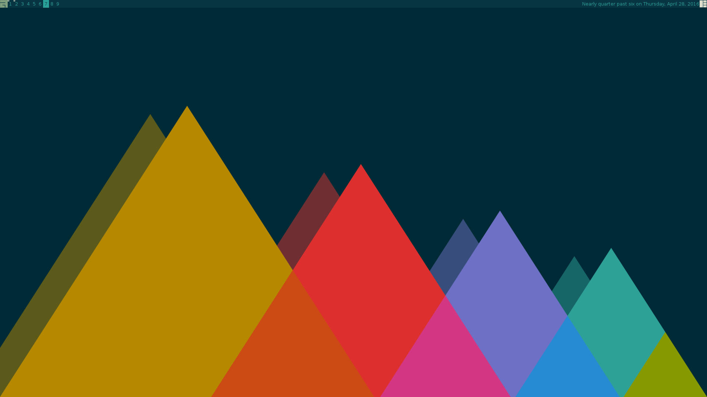

# awesome
My config files for the [awesome] window manager. If you are interested in using them, git clone to your '~/.config/awesome' directory.
[awesome]: https://awesome.naquadah.org/
### Screenshot

